# Breast Cancer Prediction and Analysis
## Predict whether the cancer is benign or malignant

**Author**: SHAILESH DHAMA

### Business problem: To predict whether the cancer is benign or malignant.

### Dataset : https://archive.ics.uci.edu/ml/datasets/Breast+Cancer+Wisconsin+(Diagnostic)

### Required Libraries :

    1.Numpy
    2.Pandas
    3.Matplotlib
    4.Seaborn
    5.scikit-learn
    6.Plotly

## STEPS :

    - Read data
    - Missing values
    - Drop useless variables
    - Exploratory Data Analysis (EDA)
    - Features distribution(hue = diagnosis)
    - Positive correlated features
    - Uncorrelated features
    - Negative correlated features
    - Principal Component Analysis
    - Confusion matrix
    - Precision-recall curve
    - ROC curve
    - Logistic Confusion matrix
    - Logistic regression with RFE
    - Predictive model : Logistic Regression
    - Predictive Model-2: Ensemble Classifier to maximise precision and detect all malignant tumors
    - Voting classifier : select threshold (recall = 100%)
    - Voting classifier : predicting with recall = 100% (precision = 92%)
    - Models performance plot (accuracy, precision, recall)

## RESULTS :

#### Data distribution
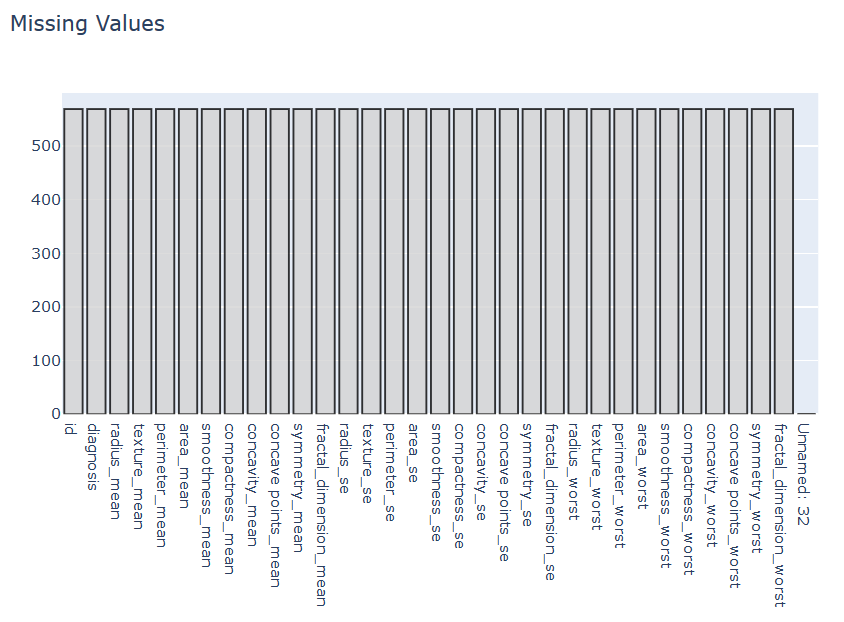
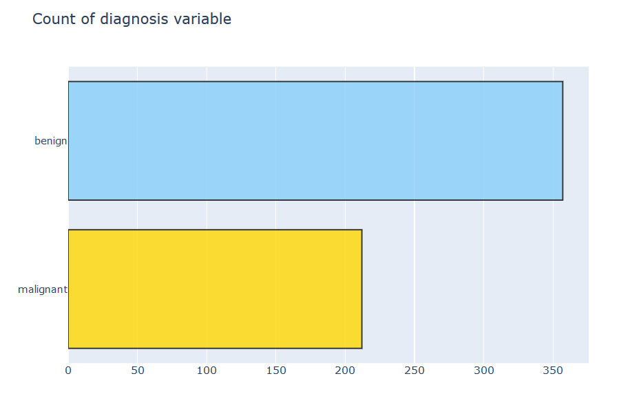
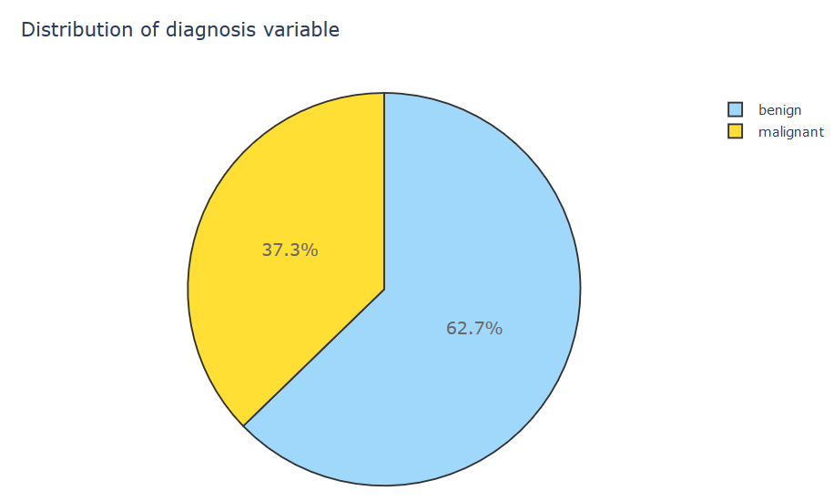
> Data distribution.

#### Features distribution(hue = diagnosis)
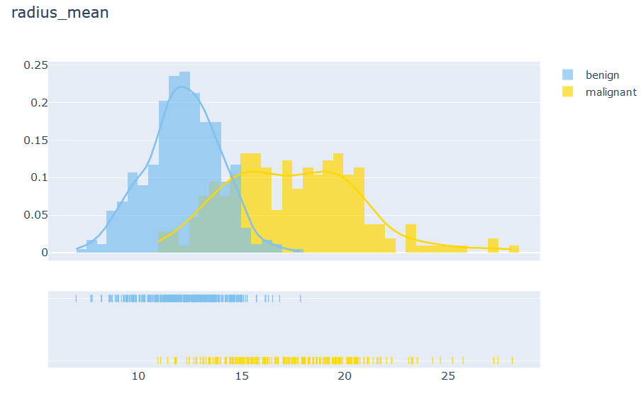
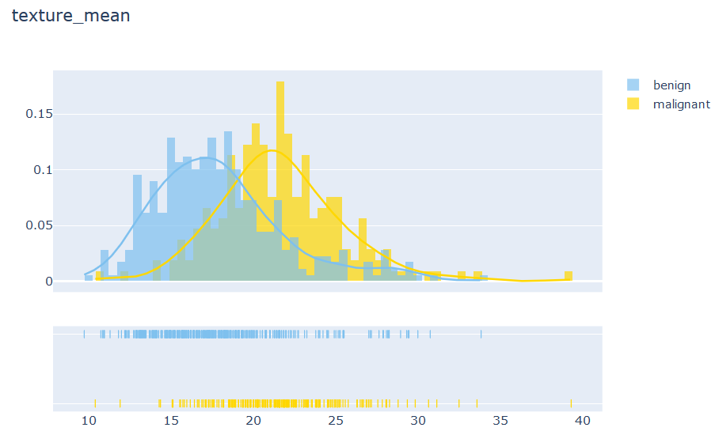
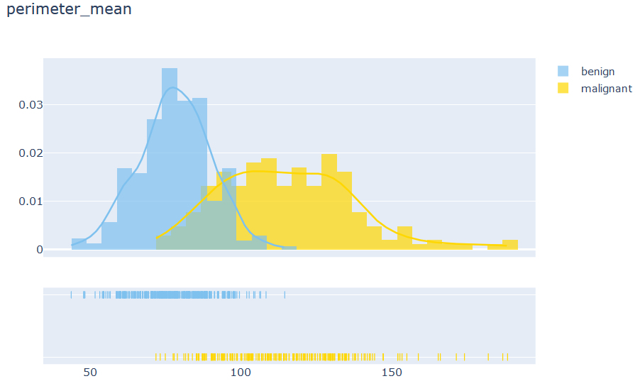
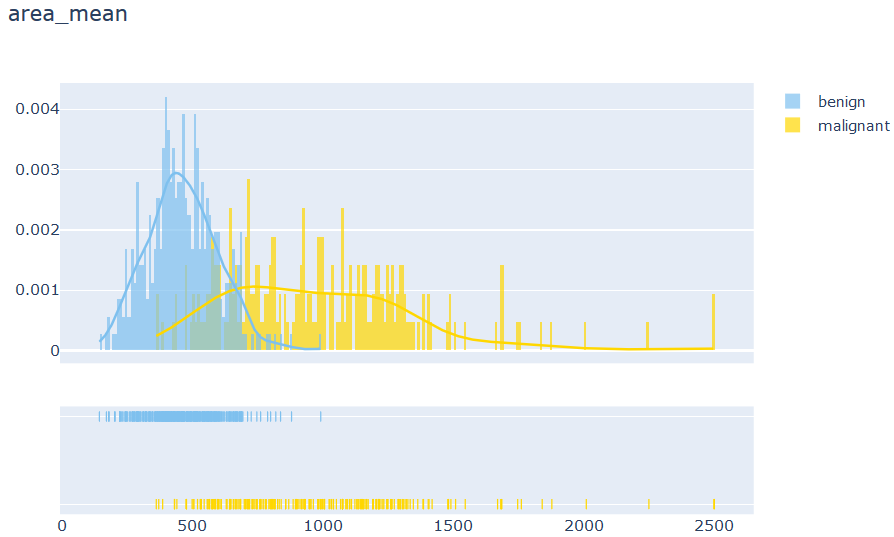
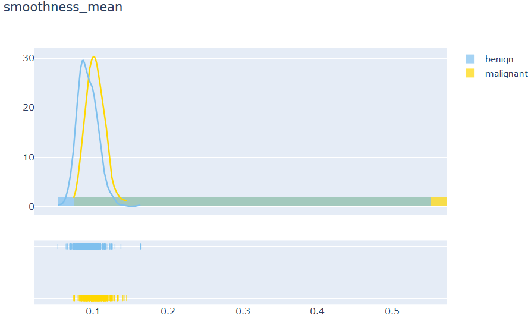
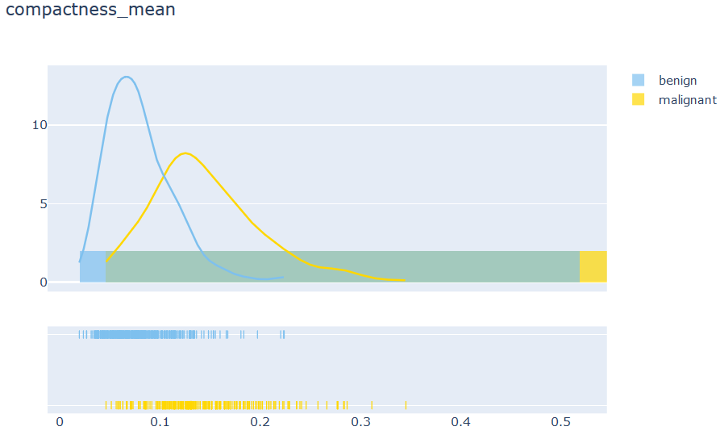
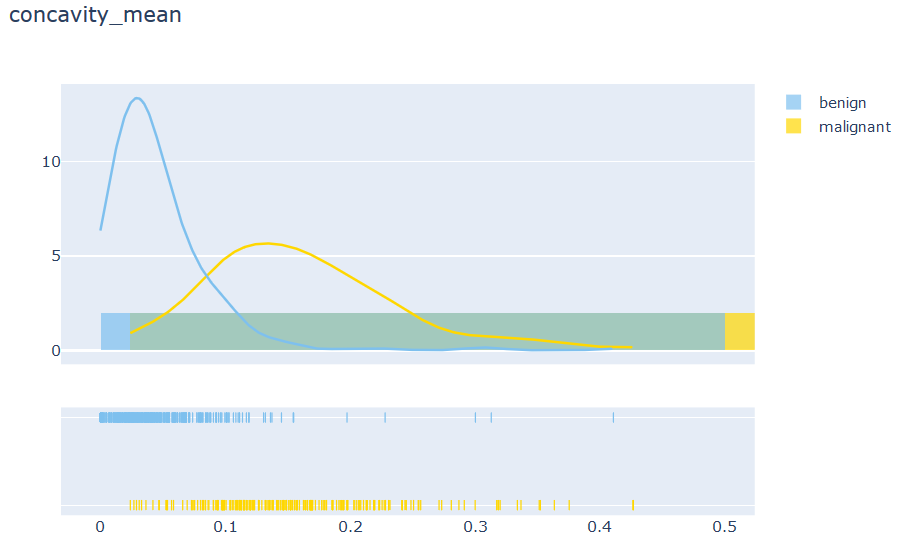
> Mean of Features distribution.

#### Correlation Matrix for Variables
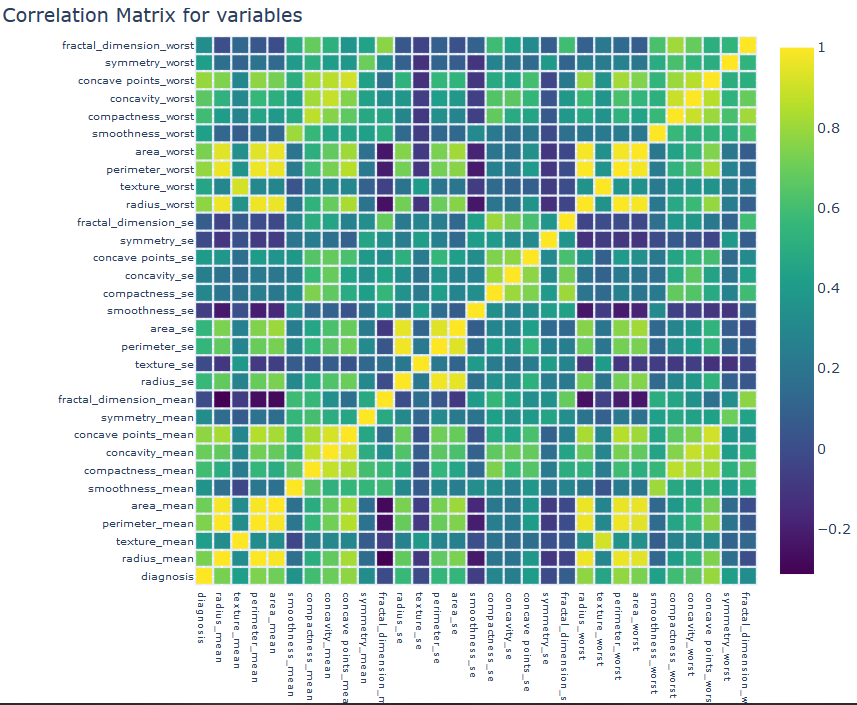
> correlation matrix


#### Positive correlated features
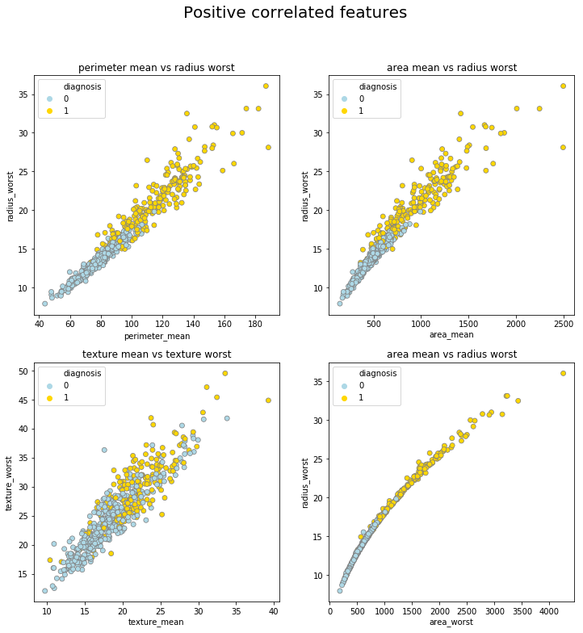
> Positive correlated features


#### Uncorrelated features
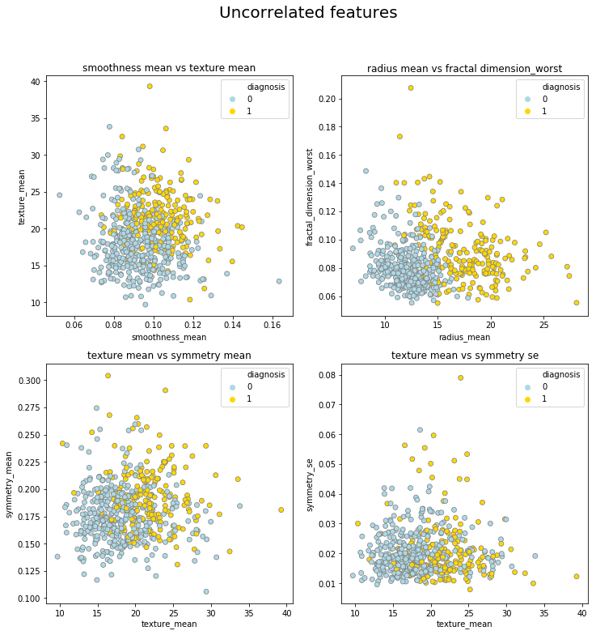
> Uncorrelated features

#### Negative correlated features
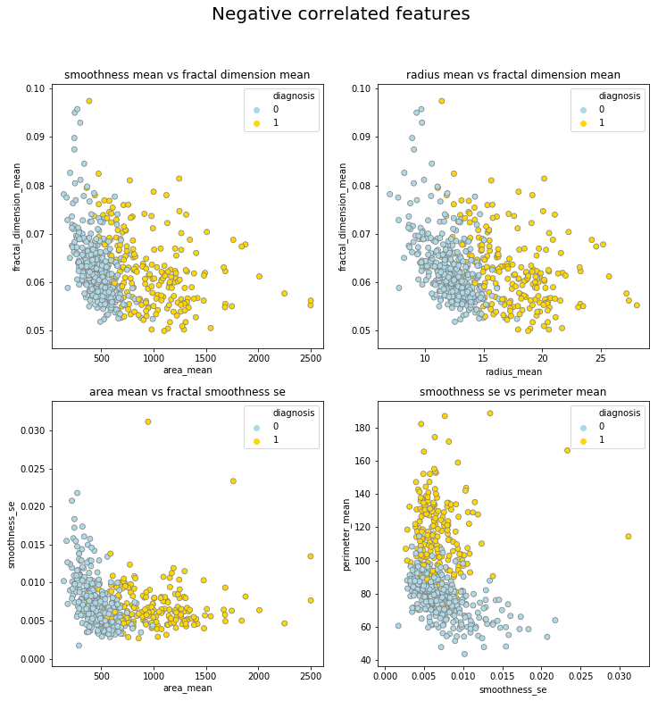
> Negative correlated features

#### Principal Component Analysis
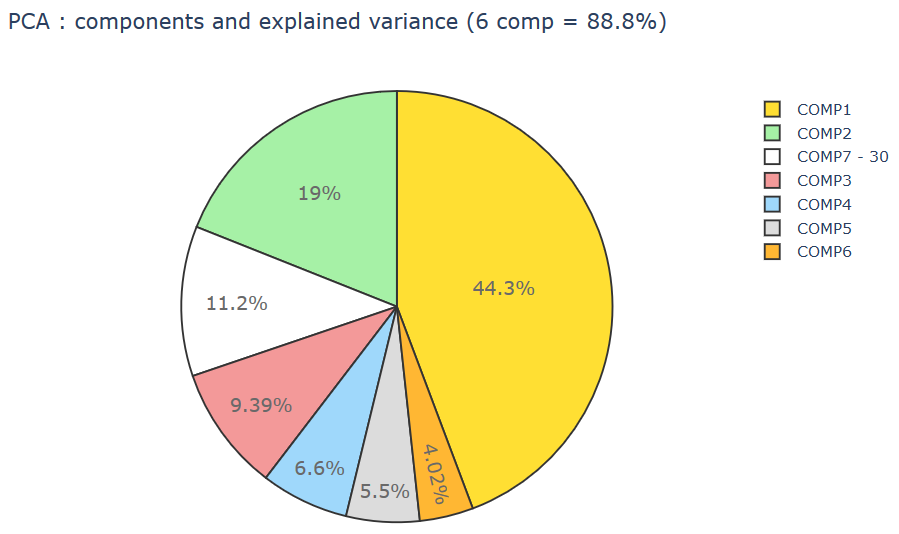
> PCA : Explained variance
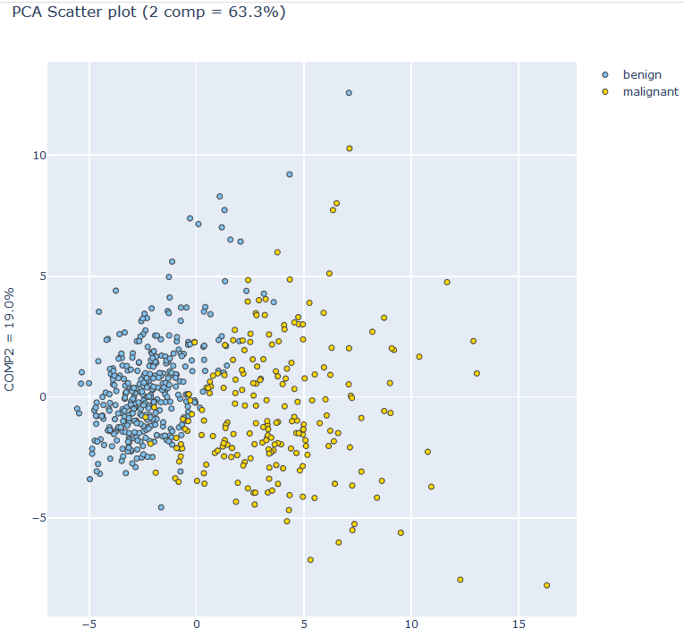
> PCA Scatter(2 Components)
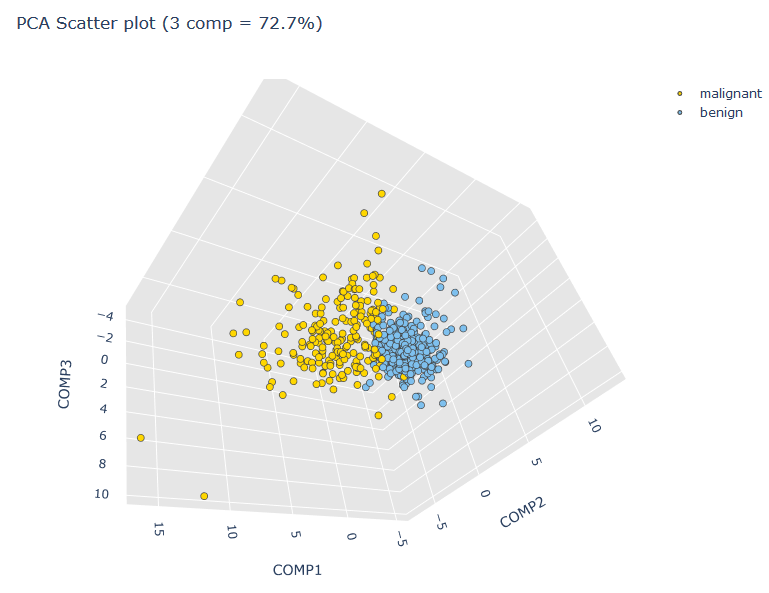
> PCA Scatter(3 Components)

### Final RESULT : Overall performance of Models.
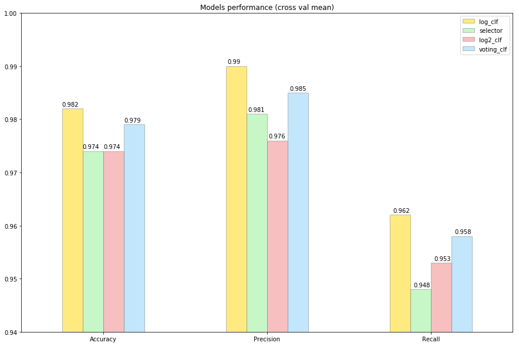
> Performance(cross_val_mean)


### For further information:

Please review the narrative of our analysis in [our jupyter notebook](./breast-cancer-analysis-and-prediction-on-winconsin.ipynb)

For any additional questions, please contact **shaileshshettyd@gmail.com)

##### Repository Structure:

```
├── README.md                                                             <- The top-level README for reviewers of this project.
├── breast-cancer-analysis-and-prediction-on-winconsin.ipynb              <- narrative documentation of analysis in jupyter notebook.
└── images                                                                <- both sourced externally and generated from code.
```
